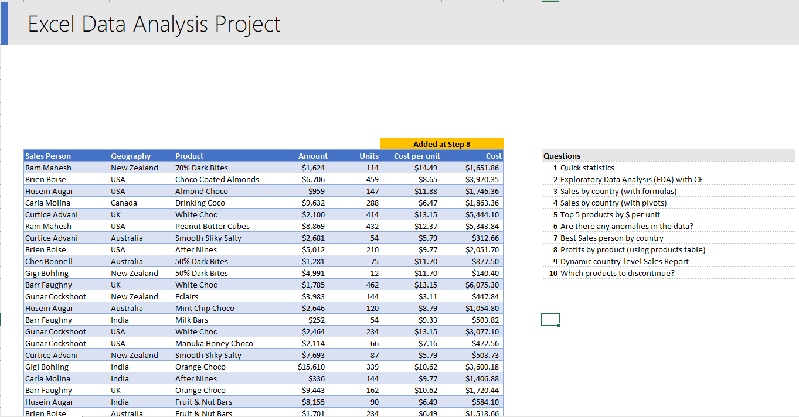
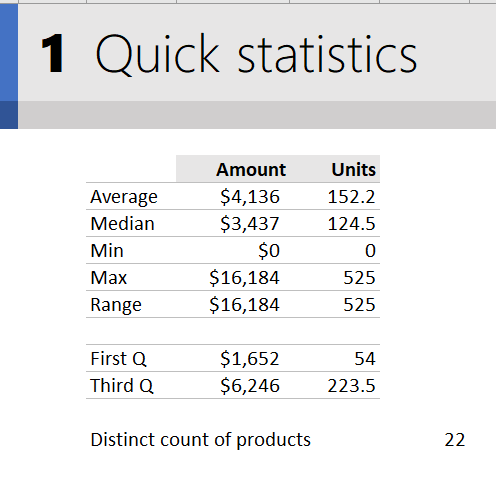
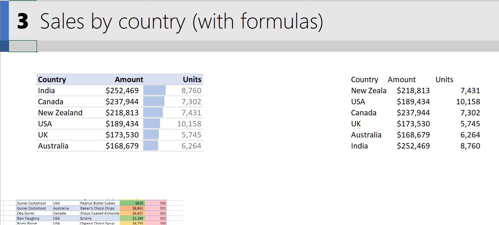
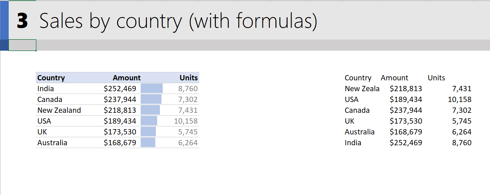
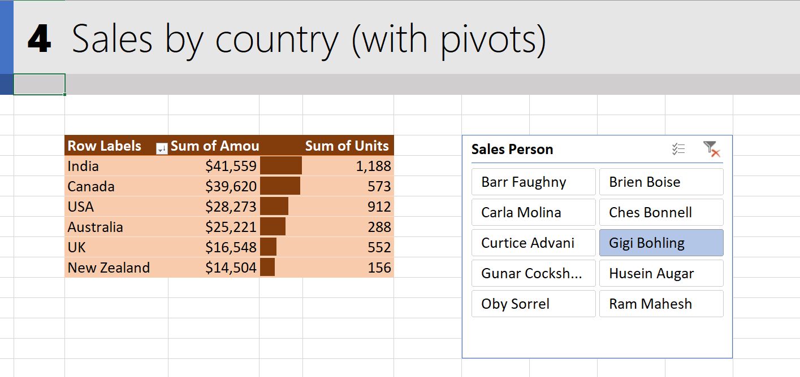
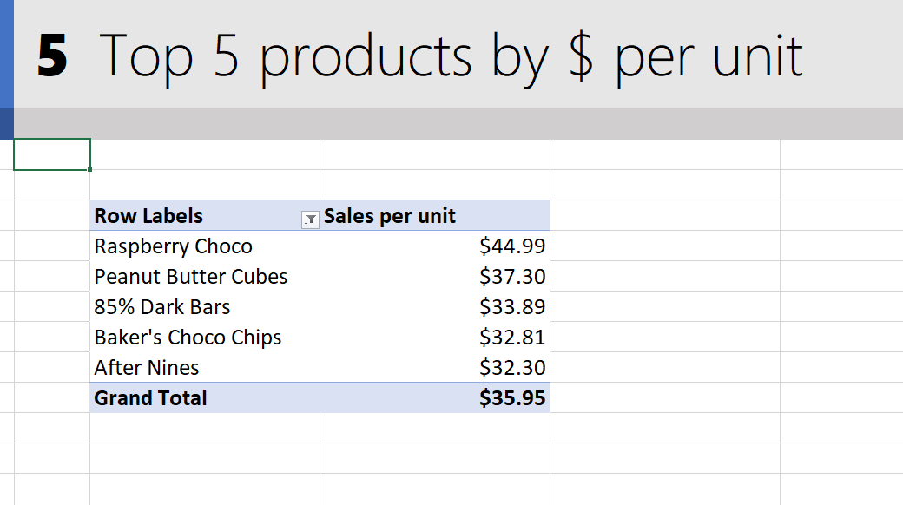
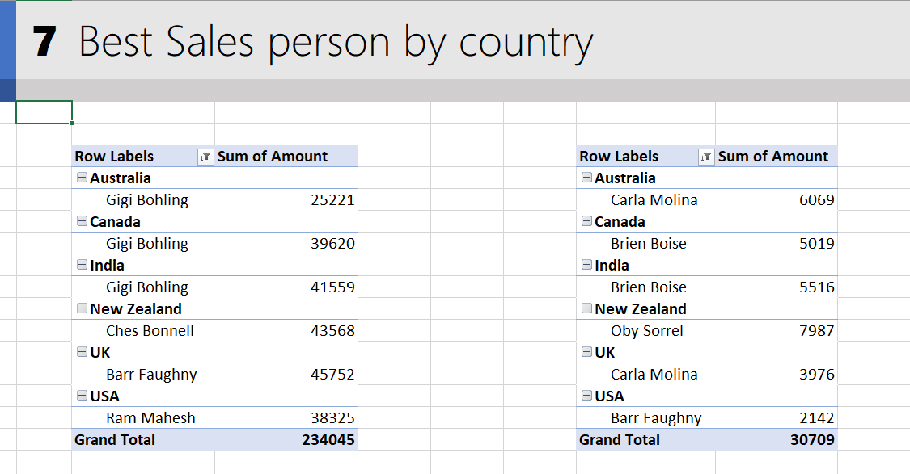
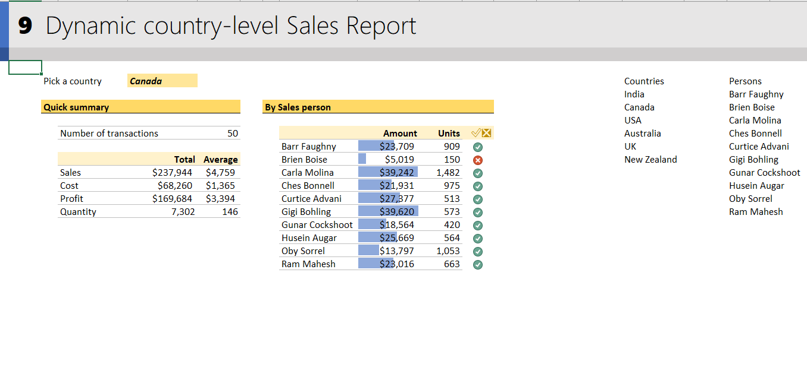
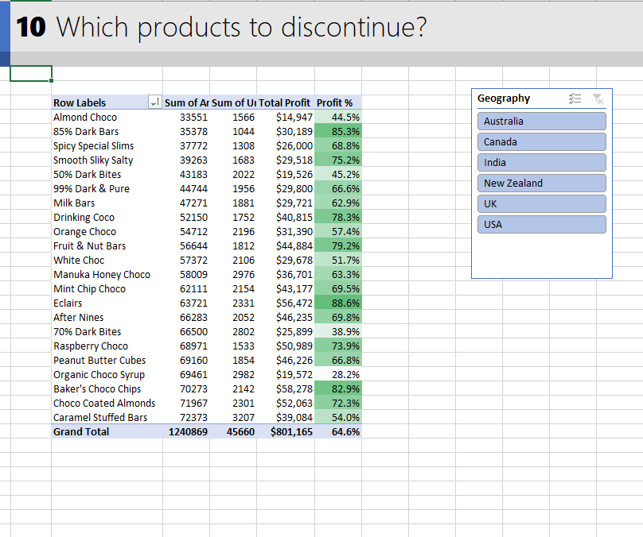

# Excel-data-analysis
It is a real-world example with 10 problems, And have used the below Excel features:
1) Using Tables
2) Formulas
3) Pivot Tables & Power Pivot measures
4) Conditional formatting
5) Charts
6) Data Validation
7) Keyboard Shortcuts & tricks
 
 
In the project I have covered the following problems :- 
 
 
Given Dataset provides the information about the sales person of different products of a chocolate brand and the amounts and the units they have sold in the differnet countries.

 
 
1. Calculating descriptive statistics (mean, median, quartiles, range, distinct items & count)

 
 
2. Exploratory data analysis 

 
 
3. Sales Analysis(with Formulas) 

 
 
4. Sales By country (With Pivot tables)

 
 
5. The Top 5 products by $ per unit.
 

 
 
6. Are there any Anamolies in the Data?

 
 
7. Best Sales Person By Country

 
 
8. Profits by Product

 
 
9. Category Report

 
 
10. Which product to discontinue?

